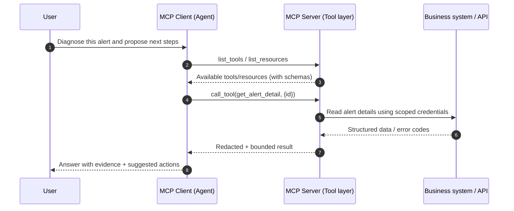

### Table of Contents
<!-- toc -->

# Introduction
AI assistants are no longer “just writing code”. The useful ones can fetch metrics, pull logs, open tickets, draft pull requests, and even propose rollout plans. Once an agent can *act*, the ceiling is no longer your model’s intelligence—it is whether the agent can **reliably and safely connect to your tools and data**.

In practice, that “tool layer” is where teams get stuck:
- Every model platform speaks a slightly different dialect of tool calling (schemas, streaming results, error shapes), which multiplies integration work.
- Governance is scattered across clients, making it hard to enforce least privilege, auditing, redaction, and budgets consistently.
- “Convenient” integrations (like exposing a raw shell) turn into security debt the moment a prompt injection tries to escalate.

Model Context Protocol (MCP) reframes this layer as a protocol and a contract. MCP lets an AI client (agent/IDE/CLI) discover and call capabilities in a consistent way, while the MCP server—running inside *your* boundary—owns authentication, policy, and audit trails [1]. If you have seen Context7 used to bring documentation context into workflows, that is an example of an MCP server in the wild [2].

This post focuses on the engineering questions that matter:
1. What problems does MCP actually solve, and when is it worth adopting?
2. What does a typical MCP call flow look like, and where are the boundaries?
3. How do you roll it out with control, auditability, and rollback paths?

# 1. MCP in one sentence
MCP is a **standard protocol between AI clients and external tools/data**, designed to decouple “agent decisions” from “tool execution” so multiple clients can reuse the same tool surface while governance stays centralised on the server side [1].

A useful analogy is “USB‑C for tool access”:
- clients only need to speak one interface (discover → call → receive structured results),
- servers wrap internal systems into safe, explicit capabilities,
- organisations can enforce consistent guardrails (permissions, audit logs, redaction, budgets) at a single choke point.

# 2. Why MCP exists: three recurring failure modes
## 2.1 Integration duplication across model platforms
Tool calling exists everywhere today—function calling, “tools”, plugins—but each ecosystem has its own framing. If your team supports multiple surfaces (IDE + CLI + web assistant + batch agents), you either accept duplicated glue code or you standardise.

MCP standardises the tool interface: write one MCP server, reuse it across MCP‑capable clients.

## 2.2 Governance scattered across clients
Once tool calls are sprinkled across clients, it becomes painful to answer basic questions:
- Who is allowed to use which tools? Do you have least privilege?
- Who called what, when, with which inputs? Are outputs redacted?
- What are your timeouts, retries, idempotency rules, and blast‑radius limits?

With MCP, these guardrails fit naturally on the server side, where execution happens.

## 2.3 Tool evolution breaks clients
Tools evolve: schemas change, upstream APIs deprecate, permissions tighten. When clients integrate directly, every change ripples outward. MCP acts like a contract layer: versioning and compatibility strategies can live in the MCP server instead of forcing every client to keep up.

# 3. The mental model: client, server, and three capability types
You do not need to memorise specs—this table is enough for day‑to‑day design [1]:

| Concept | Practical meaning | Examples |
| --- | --- | --- |
| MCP Client | the caller side | IDE extension, CLI agent, desktop assistant |
| MCP Server | the governed execution side | docs search, ticketing, monitoring, repo tools |
| Tools | executable actions with arguments | `search_docs(query)`, `create_ticket(title, body)` |
| Resources | readable objects (like files/docs) | `runbook://incident/123`, `repo://.../README` |
| Prompts | reusable task templates | incident triage template, change review checklist |

An underrated detail is that not everything must be a “function”. For knowledge integration, Resources + Prompts often produce a cleaner contract than a single overloaded tool.

# 4. A typical call flow (and why the boundary matters)
Here is a simplified sequence:



The important takeaway: the MCP server is where “execution” and “governance” converge. Clients decide *what to do*; servers decide *what is allowed* and *how it is done safely*.

# 5. Security and governance: treat MCP as a tool gateway
If you treat MCP as “just another RPC”, you will recreate the same safety problems. Treat it as a tool gateway and the design becomes clearer.

## 5.1 Prefer small, explicit tools over “万能工具”
A pragmatic rule: **many small tools beat one universal tool**.

Good patterns:
- wrap high‑risk actions into explicit tools (e.g., `rollout_restart(namespace, deployment)`), instead of passing through raw `kubectl`;
- use a two‑step flow for writes: `plan_change()` → human approval → `apply_change()`;
- enforce hard limits: timeouts, max payload size, pagination ceilings, concurrency caps.

Risky patterns:
- exposing a shell or DBA privileges;
- returning secrets, tokens, or full raw logs to the client.

## 5.2 Keep credentials on the server side, enforce least privilege
Do not place long‑lived privileged credentials into model context. Safer defaults:
- MCP server uses scoped service accounts to call downstream systems,
- each tool has its own permission boundary (read/write split, environment split),
- sensitive actions require explicit approval or short‑lived authorisation.

MCP does not magically solve auth, but it gives you a single layer to implement it consistently.

## 5.3 Validate inputs, bound outputs, and budget the blast radius
Rollouts succeed when three controls ship together:
1) **Input validation**: schema checks, allowlists, string length caps, enum bounds.  
2) **Output redaction and minimisation**: return only what the answer needs; mask PII/secrets; prefer summaries + references.  
3) **Budgets and throttles**: per‑tool QPS/concurrency/timeout; caching for expensive tools; backoff to avoid cascading failures.

## 5.4 Auditability and observability
At minimum you should be able to trace:
- which tool calls fed an answer,
- error/timeout trends per tool,
- cost and downstream load hotspots.

Treat tool calls like external dependencies and align logs/metrics/traces with your observability stack. OpenTelemetry provides a useful baseline for unified instrumentation [4].

Here is a lightweight go‑live checklist:

```text
✅ MCP Tool Go‑Live Checklist (minimum)
- Tool surface is explicit (no shell passthrough, no universal tool)
- Argument schemas are enforced (type/range/allowlist/length)
- Writes follow plan/apply with human approval when needed
- Least privilege per tool (read/write split, environment isolation)
- Audit logs exist (who/when/what tool/result summary/error code)
- Timeouts, concurrency caps, and backoff strategies are set
- Responses are redacted and bounded in size
```

# 6. A rollout playbook: from read to write
A safe adoption path is incremental:
1) **Read‑only first**: docs, runbooks, FAQs, metrics queries.  
2) **Low‑risk writes**: draft tickets, draft PR descriptions, knowledge base drafts.  
3) **High‑risk actions**: config changes, restarts, rollbacks—default to approvals and stricter policies.

This approach forces you to build the governance foundation early, before an agent gains the ability to press production buttons.

Two additional practices make rollouts smoother:
- **Treat tools like APIs**: keep tool names stable, version schemas deliberately, and offer deprecation windows. Even small schema changes can silently degrade agent behaviour if they are not backwards compatible.
- **Measure tool health**: track per‑tool success rate, timeout rate, and median/P95 latency. “Agent quality” often improves more from reliable tool surfaces than from prompt tweaks, because the model can only reason over the evidence it receives.
If you already operate SLOs for dependencies, apply the same discipline here: the tool gateway is now part of your critical path.

# 7. When MCP is not the right tool
MCP is not free. You might skip it when:
- you have a single client and a handful of stable tools—native platform tool calling may be simpler [3];
- you are extremely latency‑sensitive and want a bespoke protocol/caching strategy;
- your organisation is not ready to enforce governance yet (it is fine to start small, but design for future guardrails).

# Conclusion
MCP matters because it pulls tool access out of proprietary model features and into a governed engineering layer. As soon as agents can touch systems, data, and actions, the most valuable investment is usually not more prompt tricks—it is the contract: controlled, auditable, and evolvable.

Start with one read‑only scenario. Wrap a high‑leverage internal capability (runbooks or metrics queries) into an MCP server, ship audit logs and bounds, and expand only after the team agrees on safety boundaries.

# References
- [1] Model Context Protocol (MCP) official docs: https://modelcontextprotocol.io/
- [2] Context7 (an MCP server for documentation context): https://github.com/upstash/context7
- [3] OpenAI developer docs (Tools / Function calling guide): https://platform.openai.com/docs/guides/function-calling
- [4] OpenTelemetry docs: https://opentelemetry.io/docs/
