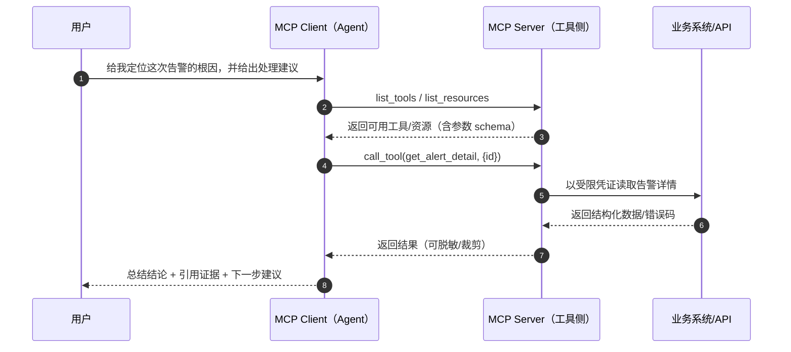

### 本文目录
<!-- toc -->

# 引言
过去一年，AI 助手的能力从“写段代码/改个函数”，走向“能调用工具把事情做完”：查指标、拉日志、改配置、生成 PR、写发布说明……真正决定体验上限的，不再是模型会不会写，而是它**能不能稳定、可控地接入你的工具与数据**。

但现实里，“工具接入”往往是最脏、最容易失控的那层：
- 你换一个模型/平台，就要重写一套工具协议与鉴权；
- 你想做权限、审计、脱敏、限流，却发现调用路径分散在各处；
- 你把工具暴露得太“通用”（例如直接给 Shell），一旦被诱导越权就很难收场。

Model Context Protocol（MCP）尝试把这层从“胶水代码”升级为“协议 + 契约”：让 AI 客户端（Agent/IDE/CLI）用一致方式发现与调用工具，让工具提供方（MCP Server）在你的边界内承接鉴权、治理与审计。你可能已经在一些工具里见过 MCP 的影子，例如把文档上下文接入到工作流的 Context7（一个 MCP Server）[2]。

本文不打算背定义，而是回答三个更实用的问题：
1. MCP 到底解决什么问题，适合哪些团队/场景？
2. 一次 MCP 工具调用的链路长什么样，边界在哪里？
3. 如果你要落地，怎么做到“可控、可审计、可回滚”？

# 1. MCP 是什么：把“工具接入”从实现细节变成协议
一句话：**MCP 是 AI 客户端与外部工具/数据之间的标准通信协议**，核心目的是把“模型能力”与“工具能力”解耦，让多种客户端用一致方式接入同一批工具，同时把安全治理集中在工具侧实现[1]。

你可以把它类比成“工具层的 USB-C”：
- 客户端只需要会“插口协议”（发现能力、调用能力、拿结果）；
- 工具侧负责把业务系统/API/数据源封装为可调用的能力；
- 组织侧更容易在这一层做统一治理：权限、审计、脱敏、预算与隔离。

# 2. 为什么需要 MCP：三类反复踩坑的问题
## 2.1 重复集成：每个模型一套“函数调用”方言
不同平台的工具调用（function calling / tools / plugins）都有自己的细节：参数 schema、消息格式、流式返回、错误结构……当你需要同时服务“IDE + CLI + Web 助手 + 批处理代理”时，集成成本会按客户端数线性增长。

MCP 的价值是把“工具协议”抽出来：你写一次 MCP Server，就能被多个 MCP Client 复用，避免每个平台各写一套。

## 2.2 难治理：权限、审计、脱敏分散在调用链里
如果工具调用逻辑散落在不同客户端里，你很难统一回答这些问题：
- 哪些工具对哪些人开放？有没有最小权限？
- 谁在什么时候调用了什么工具？输入/输出是什么？有没有脱敏？
- 失败重试/超时/幂等怎么做？对系统有没有压力放大？

把工具封装到 MCP Server 后，这些能力更适合在“工具侧”落地：集中治理、集中审计。

## 2.3 难演进：工具变更会反向拖垮客户端
工具的 schema、返回结构、权限策略一旦变化，如果客户端直连，很容易出现“客户端升级跟不上、线上能力碎片化”。MCP 更像一个契约层：工具侧可以用版本化、兼容策略、灰度发布去承接演进压力。

# 3. MCP 的核心概念：Client / Server 以及三类能力
从落地角度，不必纠结术语，抓住这张“心智模型表”就够了[1]：

| 概念 | 你可以把它理解为 | 典型例子 |
| --- | --- | --- |
| MCP Client | 发起“发现/调用”的一端 | IDE 插件、CLI Agent、桌面助手 |
| MCP Server | 把能力封装成协议的一端 | 文档检索、工单系统、监控平台、代码仓库工具 |
| Tools | **可执行动作**（有输入参数） | `search_docs(query)`、`create_ticket(title, body)` |
| Resources | **可读取资源**（像文件/文档/对象） | `runbook://incident/123`、`repo://.../README` |
| Prompts | 可复用的提示模板/任务配方 | “告警排障模板”“变更评审清单” |

你会发现：MCP 不强迫你把一切都做成“函数”。对于很多知识类接入，Resources + Prompts 往往更自然：把“可读材料”和“如何用材料”都标准化。

# 4. 一次工具调用的链路：从用户问题到结构化结果
下面是一条最典型的链路（为便于理解做了简化）：



这张图里最关键的边界是：**MCP Server 是“治理与执行”的落点**。客户端负责“决策”（该调用哪个工具、参数是什么、如何组织答案），而服务端负责“约束”（能不能调、调到哪里、返回多少、怎么记录）。

# 5. 安全与治理：让工具调用“可控、可审计、可回滚”
如果你只把 MCP 当成“又一层 RPC”，最后大概率会踩回老坑。把它当成“工具能力的 API Gateway”，才更符合它在组织里的位置。

## 5.1 工具设计：先做能力收敛，再谈开放
一个经验法则：**宁可多做几个小工具，也不要暴露一个“万能工具”**。

推荐：
- 把高风险动作做成“意图明确”的工具，例如 `rollout_restart(namespace, deployment)`，不要给 `kubectl` 原样透传；
- 对写操作做“二段式”：先 `plan_change()` 生成变更计划，再由人确认后 `apply_change()`；
- 对外部系统调用设置“硬上限”：超时、最大返回大小、分页上限、并发上限。

不推荐：
- 直接暴露 Shell/数据库管理员权限；
- 把敏感数据（令牌、密钥、完整日志）原样返回给客户端。

## 5.2 最小权限：把鉴权放在 Server 侧，把凭证留在边界内
无论你用哪种客户端，**不要把长期有效的高权限凭证交给模型上下文**。更稳妥的做法是：
- MCP Server 使用受限的服务账号访问业务系统；
- 每个工具用独立的权限域（读写分离、环境分离）；
- 为敏感操作引入“人类确认”或短期授权（例如一次性审批 token）。

这并不依赖 MCP 独有能力，而是“把凭证与策略留在服务端”的工程共识。MCP 的优势在于：你可以把这套策略集中放在 Server 层，而不是散落在每个客户端里。

## 5.3 输入/输出治理：Schema 校验、脱敏与预算要一起上
落地时建议把以下三件事当成一个整体：

1) **输入校验**：按 schema 校验类型/范围；对字符串做长度限制；对枚举做 allowlist。  
2) **输出裁剪与脱敏**：只返回回答所需字段；对账号、IP、Token、邮箱等做掩码；必要时返回“摘要 + 引用指针”。  
3) **预算与限流**：为每个工具设 QPS/并发/超时；对 expensive 工具做缓存；对失败做指数退避，避免把下游打穿。

可以把它当成“把 LLM 变成调用方之后，你必须补齐的客户端治理能力”。

## 5.4 审计与可观测：把 Tool Call 当成外部依赖调用
上线后你至少需要能回答：
- 这次回答引用了哪些工具结果？对应哪一次调用？
- 某个工具的失败率/超时是否在上升？对用户体验影响多大？
- 成本（请求量/下游开销）主要花在哪些工具上？

实践上，建议把工具调用日志结构化，并与链路追踪体系对齐（例如基于 OpenTelemetry 的指标/追踪规范）[4]，为后续复盘与风控留证据。

下面是一份可以直接贴进上线评审的最小清单：

```text
✅ MCP 工具上线前 Checklist（最小集）
- 工具清单是否收敛（无万能工具 / 无 Shell 直通）
- 参数 schema 是否可校验（类型/范围/allowlist/长度）
- 写操作是否二段式（plan/apply）+ 人工确认（如适用）
- 每个工具是否最小权限（读写分离 / 环境隔离）
- 是否具备审计日志（谁/何时/调了什么/结果摘要/错误码）
- 是否具备超时、并发上限与退避重试策略
- 返回结果是否脱敏 + 限制最大返回大小
```

# 6. 落地路线图：从“读”到“写”的渐进式试点
如果你准备在团队里引入 MCP，一个更稳的路径是“先读后写、先低风险后高风险”：

1) **只读试点（最快闭环）**：文档检索、Runbook、FAQ、指标查询。  
2) **低风险写入**：创建工单草稿、生成 PR 描述/发布说明、更新知识库草稿（不直接上线）。  
3) **高风险动作（必须上治理）**：改配置、重启服务、回滚发布——默认需要审批或人工确认。

这样做的好处是：你先把“协议、审计、脱敏、限流”这些地基打牢，再逐步扩大工具半径，而不是一开始就让代理握着生产变更按钮。

# 7. MCP vs 其他方式：什么时候用，什么时候不用
MCP 并不是对所有团队都划算，你可以按下面的判断：

适合 MCP 的情况：
- 你有多个 AI 客户端（CLI/IDE/Web/机器人）需要共用同一批工具；
- 你在意统一治理（权限、审计、脱敏、预算、隔离）；
- 你希望工具能力可演进、可版本化，而不是绑死在某个模型平台。

不一定要 MCP 的情况：
- 只有单一客户端、工具很少且变化不大：直接用平台自带的工具调用也许更省事[3]；
- 极致低延迟或高吞吐场景：你可能更愿意定制协议与缓存策略；
- 组织暂时没有治理诉求：先把问题跑通也没错，但要给未来“补治理”留接口。

# 结语
MCP 的意义不在于“又多了一个协议”，而在于它把工具接入从“某个模型的私有能力”拉回到“工程团队可治理的公共基础设施”。当你的 AI 代理开始真正触达系统、数据与动作时，最值得投入的往往不是提示词花活，而是这层契约：可控、可审计、可演进。

建议从一个只读场景开始：把你最常用的 Runbook/指标查询封装成 MCP Server，先把治理闭环做出来；当团队对“工具调用的边界”达成共识后，再逐步把能力扩展到写入与自动化执行。

# 参考资料
- [1] Model Context Protocol（MCP）官方文档：https://modelcontextprotocol.io/
- [2] Context7（MCP Server，提供文档上下文）：https://github.com/upstash/context7
- [3] OpenAI 开发者文档（Tools / Function calling 指南）：https://platform.openai.com/docs/guides/function-calling
- [4] OpenTelemetry 官方文档：https://opentelemetry.io/docs/

