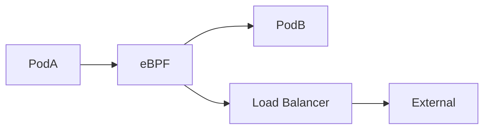

### 本文目录
<!-- toc -->

# 引言
> eBPF 通过内核可编程带来高可见性与性能。Cilium 将 eBPF 应用于 Kubernetes 网络、可观测与安全。本文介绍 Cilium 架构、Hubble 观测与实际案例。

# Cilium 架构
- eBPF 替代 iptables，实现高性能数据路径；
- Cilium Agent 管理 eBPF 程序；
- Hubble 提供网络观测与 Service Map；
- 支持 L3-L7 策略、身份感知。

# 数据路径

# 可观测能力
- Hubble UI 展示服务拓扑；
- CLI `hubble observe` 过滤流量；
- 导出指标至 Prometheus；
- 支持 L7 请求日志、延迟分析。

# 安全功能
- 基于身份（Identity）定义策略；
- DNS Policy、HTTP Policy；
- 与 SPIFFE、Istio 集成；
- 使用 Tetragon 实现进程级审计。

# 实战经验
- 替换 Calico 提升网络性能；
- 利用 Hubble 快速定位请求延迟与丢包；
- eBPF 程序调试：`cilium monitor`, `bpftool`; 
- 升级时注意内核版本兼容。

# 总结
Cilium 利用 eBPF 提供高性能网络与可观测性。结合 Hubble 与策略控制，可显著提升容器网络治理能力。

# 参考资料
- [1] Cilium Documentation. https://docs.cilium.io
- [2] Hubble Observability. https://docs.cilium.io/en/latest/gettingstarted/hubble/
