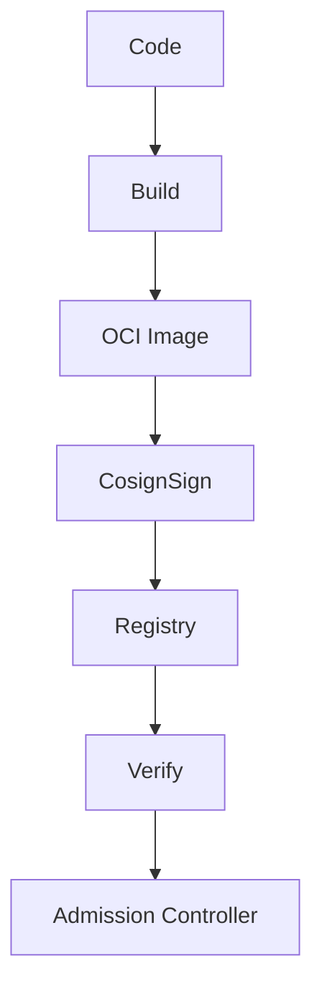

### 本文目录
<!-- toc -->

# 引言
> 镜像供应链安全是云原生合规的重要组成。从构建、签名、分发到运行安全，需建立全链路控制。本文介绍镜像安全流程与主流签名方案（Notary, Cosign, Sigstore）。

# 供应链安全流程
1. 源代码扫描（SAST）；
2. 构建环境隔离（BuildKit、Kaniko）；
3. 镜像签名与元数据生成；
4. 扫描漏洞（Trivy、Grype）；
5. 策略准入（OPA、Kyverno）；
6. 持续监控与回滚。

# 镜像签名方案
- **Docker Content Trust / Notary v1**：基于 TUF；
- **Notary v2 + OCI Artifact**：支持多签名和元数据；
- **Sigstore Cosign**：使用 OIDC + TUF，简化密钥管理；
- **Harbor**：内置签名与漏洞扫描。

# Cosign 工作流

# 准入策略
- 在 Kubernetes 中使用 `Cosign + Gatekeeper` 校验签名；
- Kyverno `verifyImages`；
- 仅允许来自可信仓库的镜像；
- 版本回退需保留签名。

# 密钥管理
- 硬件钥匙（YubiKey）、KMS（AWS KMS, GCP KMS）；
- Sigstore Fulcio + Rekor（透明日志）；
- 定期轮换、最小权限；
- 审计签名操作。

# 总结
镜像供应链安全包含构建、签名、扫描与准入多个环节。通过 Cosign/Sigstore 等工具结合策略控制，可保障镜像可信度。

# 参考资料
- [1] Sigstore Documentation. https://sigstore.dev/docs/
- [2] CNCF Secure Supply Chain Best Practices.
