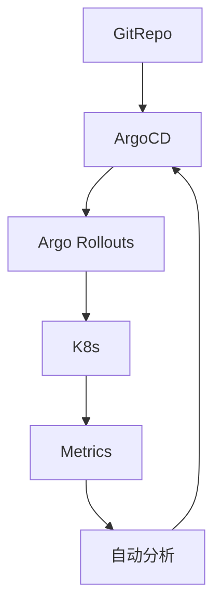

### 本文目录
<!-- toc -->

# 引言
> GitOps 通过 Git 管理声明式配置，ArgoCD 实现持续交付。结合渐进式发布（蓝绿、金丝雀、分阶段），可降低变更风险。本文分享 ArgoCD 工作流与 Progressive Delivery 实践。

# GitOps 基本流程
- Git 仓库存储期望状态；
- ArgoCD Application 监控仓库；
- 自动或手动同步至集群；
- 记录审计与回滚。

# 渐进式发布
- Argo Rollouts 或 Flagger 扩展；
- 策略：金丝雀、蓝绿、实验流量；
- 指标驱动回滚（Prometheus、Kayenta）；
- 多阶段审批与自动化测试。

# 工作流示意

# 实践建议
- ApplicationSet 管理多集群部署；
- 使用 PR 审核与 CI 校验（kubeval、kustomize build）；
- 配置 SSO、RBAC，控制同步权限；
- 设定 Sync Policy（自动/手动），启用波次同步。

# 监控
- ArgoCD Notifications 通知同步状态；
- Rollouts Dashboard 展示进度；
- 结合 Prometheus/Alertmanager，延迟超标即回滚。

# 总结
GitOps + ArgoCD + Progressive Delivery 构建了安全、可追踪的发布流程。通过自动化分析与回滚，能大幅降低发布风险。

# 参考资料
- [1] ArgoCD Documentation. https://argo-cd.readthedocs.io
- [2] Argo Rollouts. https://argoproj.github.io/argo-rollouts/
