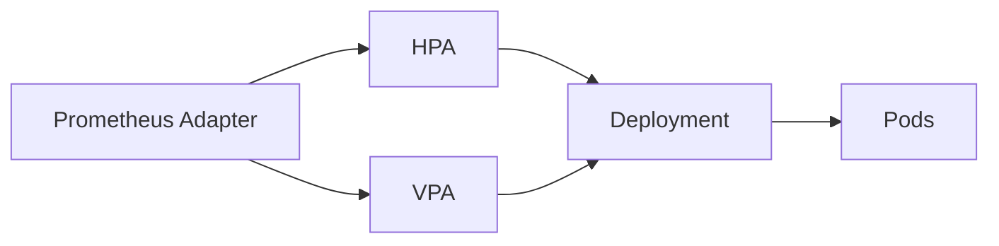

### 本文目录
<!-- toc -->

# 引言
> Horizontal Pod Autoscaler (HPA) 与 Vertical Pod Autoscaler (VPA) 分别从水平与垂直维度调度资源。联合使用可提升资源利用率。本文分享 HPA+VPA 架构、冲突处理与调优案例。

# 基础机制
- HPA：基于 CPU、内存或自定义指标调整副本数；
- VPA：推荐容器 requests/limits，支持自动更新或仅推荐；
- Kubernetes 官方建议二者联合时 VPA 设置为 `Off` 或 `Auto` + HPA ；
- 使用 Metrics Server + Prometheus Adapter 提供指标。

# 联合架构

# 调优步骤
1. 启用 VPA（recommendation 模式）收集数据；
2. 分析推荐值，手动调整 requests；
3. 配置 HPA (`minReplicas`, `maxReplicas`, `targetAverageUtilization`);
4. 对关键应用设置 PodDisruptionBudget；
5. 使用 `kube-state-metrics` 监控自动扩缩容。

# 冲突避免
- 避免 VPA 自动模式与 HPA 同时作用（会频繁重建 Pod）；
- 对实时服务选择 HPA + VPA Recommend；
- 批处理任务可使用 VPA 自动更新，HPA 作为峰值保障。

# 实战案例
- 在线广告服务：HPA 基于 QPS，VPA 提供 CPU/内存建议；
- 数据处理任务：夜间 VPA 自动增加内存，HPA 限制最大副本；
- 监控指标：`hpa_status_desired_replicas`, `vpa_recommendation_cpu`。

# 总结
HPA 与 VPA 联合调优需明确职责，避免资源震荡。以 VPA 推荐 + HPA 实施为主，辅以指标监控和限流策略，可在保证性能的同时提高资源利用率。

# 参考资料
- [1] Kubernetes Autoscaling Concepts. https://kubernetes.io/docs/tasks/run-application/horizontal-pod-autoscale/
- [2] VPA User Guide. https://github.com/kubernetes/autoscaler/tree/master/vertical-pod-autoscaler
