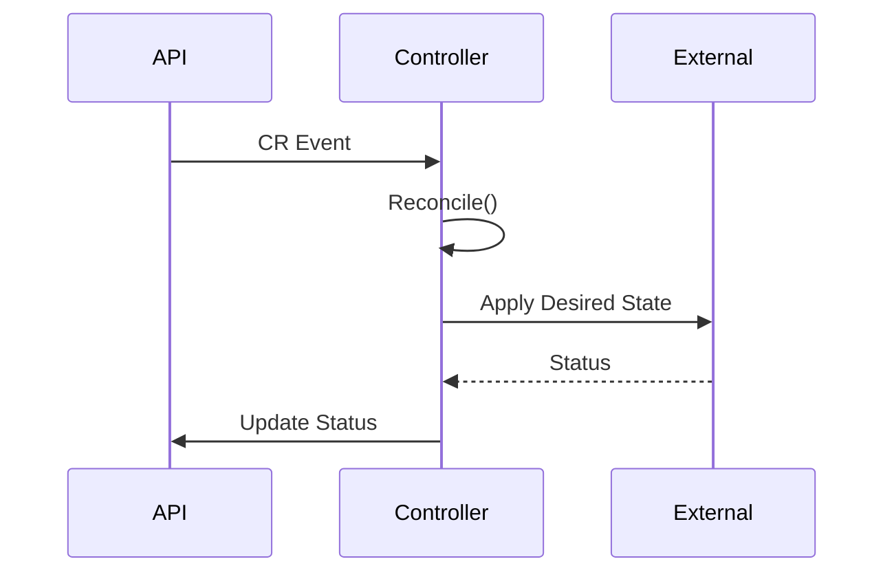

### 本文目录
<!-- toc -->

# 引言
> Operator 通过自定义资源（CRD）与控制器自动化运维复杂应用。本文梳理 Operator 设计模式、生命周期管理与常用框架（Kubebuilder、Operator SDK）。

# Operator 核心概念
- CustomResourceDefinition (CRD)：定义 API；
- Controller：监控资源变化，执行 Reconcile；
- Reconcile Loop：确保实际状态与期望状态一致；
- Finalizer：处理资源删除清理。

# 设计模式
- **替换控制器**：完全接管应用生命周期；
- **附属控制器**：扩展现有资源（如 PodPolicy）；
- **协作控制器**：与 StatefulSet/Deployment 协同；
- **外部系统集成**：管理云资源（数据库、负载均衡）。

# 控制循环流程

# 实践建议
- 规范 CRD：版本化、Validation Schema、OpenAPI 定义；
- 状态管理：在 Status 中报告 Phase、Conditions；
- 幂等设计：Reconcile 必须可重入；
- 观察指标：Reconcile 次数、失败率；
- 测试：Envtest、e2e。

# 开发框架
- Kubebuilder：基于 controller-runtime，支持 Webhook、Admission；
- Operator SDK：封装 Kubebuilder，提供 Helm/Ansible Operator；
- Crossplane：声明性管理云资源。

# 总结
Operator 模式让复杂系统在 Kubernetes 中自动化管理。通过良好的 CRD 设计、幂等 Reconcile 与可观测性建设，可以构建稳健的云原生运维工具。

# 参考资料
- [1] Kubebuilder Book. https://book.kubebuilder.io/
- [2] Operator Pattern. https://kubernetes.io/docs/concepts/extend-kubernetes/operator/
