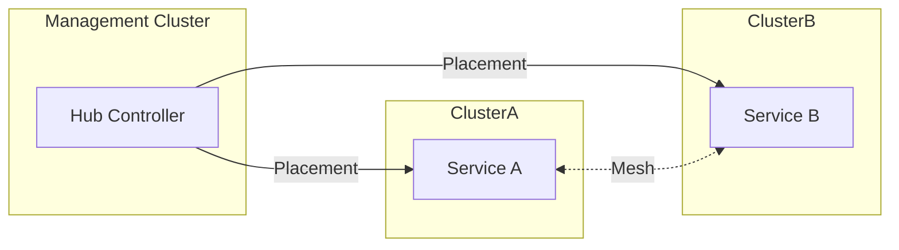

### 本文目录
<!-- toc -->

# 引言
> 多集群部署是企业大规模云原生环境的常态。Kubernetes 联邦（Kubefed）、多集群网格与 GitOps 管道共同构成治理体系。本文梳理多集群架构模式、跨集群资源同步与运维实践。

# 多集群架构模式
- **集中式联邦控制面**：Kubefed 控制资源模板与放置策略；
- **分布式控制面 + Service Mesh**：集群自治，通过 Istio/Linkerd 实现服务互通；
- **GitOps 驱动**：每个集群由独立 Git 仓库管理，ArgoCD/Flux 统一编排；
- **托管服务**：如 GKE Hub、Anthos、AKS Fleet 提供集中管理界面。

# 联邦核心概念
- FederatedTypeConfig：注册需要联邦的资源类型；
- FederatedResource：描述模板（spec.template）与放置策略（spec.placement）；
- Placement：选取目标集群（clusters/ClusterSelector）；
- Override：针对特定集群覆写字段。

# 服务治理

# 跨集群网络
- 使用 Service Mesh（Istio multi-primary、mcIstio）；
- Submariner / Cilium Cluster Mesh 打通网络；
- DNS 控制：CoreDNS 联邦、ExternalDNS；
- 安全：mTLS、NetworkPolicy、Zero Trust。

# GitOps 运维流程
1. 定义资源模板（Helm/Kustomize）；
2. 在管理集群仓库维护联邦 CR；
3. ArgoCD ApplicationSet 根据集群列表生成 Application；
4. 观察漂移，自动回滚；
5. 结合 Policy（OPA/Gatekeeper）统一准入。

# 监控与告警
- 多集群 Prometheus 联邦或 Thanos 聚合；
- 日志集中到 Loki/Elastic；
- 健康检查：Cluster API、KubeFedStatus；
- 对跨集群延迟、同步失败配置告警。

# 实战经验
- 资源差异：通过 Override 调整每个集群的副本数、存储类；
- 自定义控制器：在 GitOps 中封装跨集群配置，如 Istio Gateway；
- 扩展 Hook：同步前执行验证脚本。

# 总结
多集群联邦治理需要控制面、网络、GitOps 与策略协同。通过 Kubefed 或云厂商平台，加上统一可观测与安全策略，可以在大规模集群中保持一致性与自治。

# 参考资料
- [1] Kubernetes Multi-Cluster Services. https://kubernetes.io/docs/tasks/multicluster/
- [2] Kubefed User Guide. https://github.com/kubernetes-sigs/kubefed
- [3] Istio Multicluster Install. https://istio.io/latest/docs/setup/install/multicluster/
