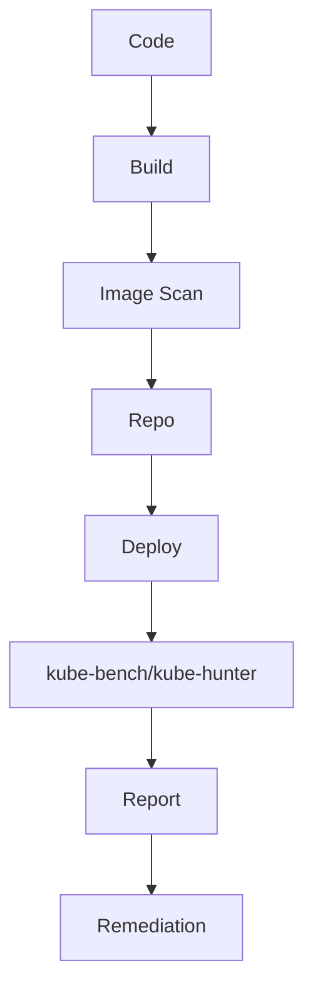

### 本文目录
<!-- toc -->

# 引言
> Kubernetes 集群必须遵循安全基线（CIS Benchmark、NSA 指南等）。本文总结安全加固步骤、漏洞扫描与持续合规流程。

# 安全基线要点
- 控制平面加固：API Server TLS、审计日志、RBAC 最小权限；
- 节点安全：禁用未使用服务、内核参数配置；
- Pod 安全：限制特权、使用 PSP/PodSecurity、Seccomp；
- 网络安全：NetworkPolicy、Service Mesh mTLS。

# 漏洞扫描
- 集群配置扫描：kube-bench（CIS）、kube-hunter；
- 镜像扫描：Trivy、Anchore；
- 依赖与 SBOM；
- 定期扫描、报告评估。

# 自动化流程

# 合规治理
- 建立风险分级、整改 SLA；
- 变更前执行安全评估；
- 与 SIEM 集成，追踪异常；
- 定期审计 RBAC、Secret 管理。

# 总结
通过安全基线检查、漏洞扫描与自动化治理，可构建持续安全的 Kubernetes 集群。

# 参考资料
- [1] CIS Kubernetes Benchmark. https://www.cisecurity.org
- [2] NSA & CISA Kubernetes Hardening Guide.
