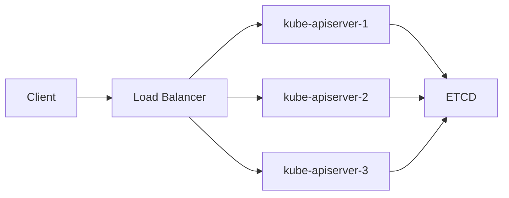

### 本文目录
<!-- toc -->

# 引言
> 控制平面负责集群 API、调度与状态维护，必须具备高可用（HA）能力。本文介绍控制平面组件、HA 拓扑、存储与运维要点。

# 控制平面组件
- kube-apiserver：前端统一入口；
- etcd：状态存储；
- kube-controller-manager：控制循环；
- kube-scheduler：调度；
- cloud-controller-manager：云资源集成。

# HA 拓扑
- 堆叠控制面：控制平面与 etcd 同节点，适合中小集群；
- 外部 etcd：etcd 独立集群，控制面横向扩展；
- 跨可用区部署，使用负载均衡（L4/L7）暴露 apiserver；
- 采用奇数节点（3/5）保证 etcd 仲裁。

# etcd 设计
- SSD/NVMe 提升 IOPS；
- 调整 `--quota-backend-bytes`；
- 启用快照备份与压缩；
- 使用 TLS 保护通信；
- 监控 `etcd_server_has_leader`, `wal_fsync_duration_seconds`。

# kube-apiserver 前端

# 运维实践
- 使用 kubeadm/Cluster API 自动化部署；
- 控制面滚动升级前备份 etcd；
- 启用 `PodDisruptionBudget` 保证组件存活；
- 配置健康检查（/readyz, /livez）。

# 监控
- Prometheus 收集 API QPS、请求延迟；
- etcd Exporter 监控 Leader 选举与存储；
- Loki/Elastic 收集控制面日志；
- Alertmanager 对领导者丢失、延迟升高报警。

# 总结
控制平面 HA 需要从架构（奇数节点、外部 etcd）、网络（LB）到运维（备份、监控）多层保障。通过自动化部署与持续观测，可保持集群稳定。

# 参考资料
- [1] Kubernetes Production Environment Best Practices. https://kubernetes.io/docs/setup/production-environment/cluster-high-availability/
- [2] etcd Operator Guide. https://etcd.io/docs/latest/
