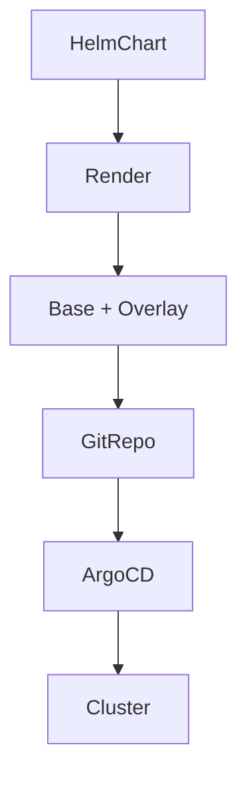

### 本文目录
<!-- toc -->

# 引言
> Helm 与 Kustomize 各有优势。Helm 擅长模板化和发布，Kustomize 更适合覆盖与组合。本文分享两者协同的 GitOps 管理模式。

# 组合模式
- Helm 管理基础模板，Kustomize 用于环境覆盖；
- 使用 Helm Chart Renderer + Kustomize Patch；
- 或 Helmfile/Flux Helm Controller 中内建的 Kustomize 支持；
- 通过 ApplicationSet 自动生成部署。

# 流程示意

# 实践建议
- 规范目录结构：`charts/`、`overlays/prod`；
- 使用 `postRenderer` 进行 Kustomize 覆盖；
- 版本管理：Helm Chart version + Overlay tag；
- 引入 `kustomize build --enable-helm` 简化流程。

# 验证与测试
- `helm template` + `kustomize build` 在 CI 中 diff；
- kubeval、kubeconform 校验；
- 集成 Policy（OPA）确保合规。

# 总结
Helm 与 Kustomize 协同可以兼顾模板复用与环境差异。结合 GitOps 与自动化验证，可高效管理大规模 Kubernetes 配置。

# 参考资料
- [1] Helm Documentation. https://helm.sh/docs/
- [2] Kustomize Guide. https://kubectl.docs.kubernetes.io/guides/introduction/kustomize/
