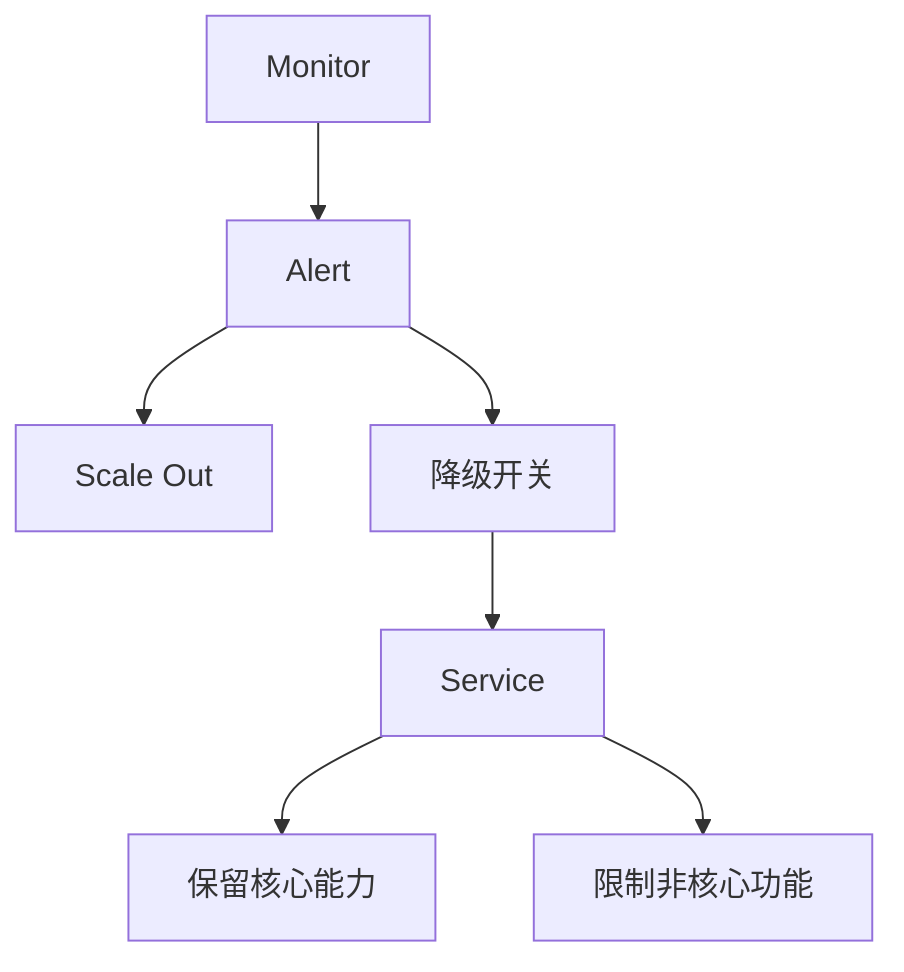

### 本文目录
<!-- toc -->

# 引言
> 在流量突增或资源紧张时，服务需要保持核心功能可用，进行优雅降级。Kubernetes 提供多层 QoS 控制、限流与熔断机制。本文总结实现思路与实践案例。

# Kubernetes QoS 类别
- Guaranteed：requests=limits；
- Burstable：requests < limits；
- BestEffort：无 requests/limits；
- 通过 QoS 配合 PriorityClass、PodDisruptionBudget 实现资源保障。

# 流量治理
- Ingress/Gateway 限流（NGINX、Istio）；
- Envoy Filter/Service Mesh 调整重试与timeout；
- Pod 内使用 Resilience4j、RateLimiter；
- 对非核心功能启用 Feature Flag 控制。

# 优雅降级流程

# 实践建议
- 定义降级标准：延迟、错误率、资源使用；
- 基于 ConfigMap/Feature Flag 调整功能；
- 编排 Sidecar（Envoy）实现灰度与限流；
- 使用 Chaos 测试降级流程；
- 监控降级后指标与恢复策略。

# 总结
Kubernetes 提供 QoS 分类、优先级、流量治理插件等能力。结合业务降级策略与自动化控制，可以保障核心服务在异常场景下仍可用。

# 参考资料
- [1] Kubernetes QoS Classes. https://kubernetes.io/docs/tasks/configure-pod-container/quality-service-pod/
- [2] Istio Traffic Management.
