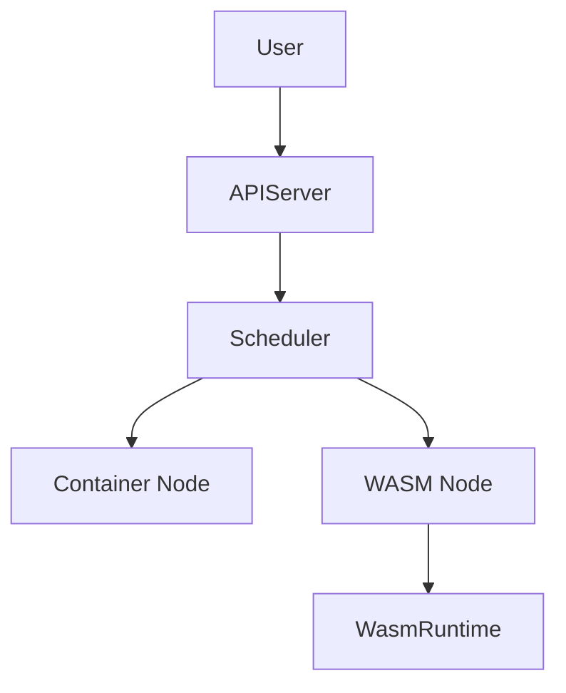

### 本文目录
<!-- toc -->

# 引言
> WebAssembly（WASM）轻量、安全的特点使其成为容器的补充。本文讨论 WASI、WasmEdge、Krustlet 等方案，以及与容器共存的混合架构。

# WASM 运行时
- Wasmtime、WasmEdge、Spin；
- 支持 WASI 系统接口；
- 低启动延迟，适合边缘与函数计算。

# 与 Kubernetes 集成
- Krustlet：WASM 节点代理；
- wasmCloud、Fermyon Spin Controller；
- 使用 Containerd shim（runwasi）；
- 混合调度：基于节点标签选择运行时。

# 架构示意

# 应用场景
- Serverless 函数、插件系统；
- 边缘端轻量应用；
- 安全隔离要求高的场景；
- 需要跨语言、快速启动的任务。

# 挑战
- 生态成熟度与标准化；
- 运行时能力受限（系统调用、POSIX）；
- 观测与调试工具不足；
- 镜像和打包标准仍在演进（OCI Artifact）。

# 总结
WASM 正与容器形成互补。通过运行时、调度和工具链的不断完善，未来可在云原生平台中提供更轻量、安全的执行环境。

# 参考资料
- [1] CNCF WebAssembly Landscape.
- [2] WasmEdge + Kubernetes 实践指南.
