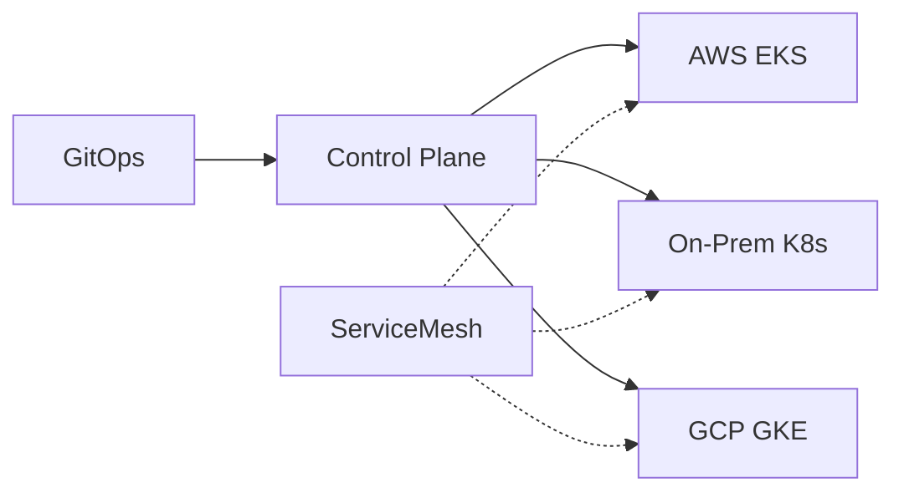

### 本文目录
<!-- toc -->

# 引言
> 企业常在多云、私有云同时运行容器工作负载。混合云调度需要解决资源发现、网络互联与数据一致性。本文总结典型架构与调度模式。

# 调度模式
- 单控制面多节点：使用公共控制面管理混合节点；
- 多集群协同：每云一个集群，通过 Kubefed/GitOps 管理；
- 云原生调度器扩展（Clusternet、Karmada）；
- 基于工作负载类型划分区域。

# 关键要素
- 网络互联：VPN、SD-WAN、Service Mesh；
- 存储同步：对象存储、数据复制；
- 身份与安全：集中身份认证、策略统一；
- 成本与合规：区域成本、数据主权。

# 架构示意

# 实践建议
- 使用 Karmada/Clusternet 实现跨集群调度；
- 统一日志、监控与安全策略；
- 采用基础设施即代码管理网络与存储资源；
- 通过性能测试与容量规划确定工作负载放置策略。

# 总结
混合云调度需要在控制面、网络、安全与成本之间取得平衡。借助多集群管理框架与自动化工具，可实现灵活的跨云容器调度。

# 参考资料
- [1] Karmada Documentation. https://karmada.io
- [2] CNCF Hybrid Cloud Whitepaper.
