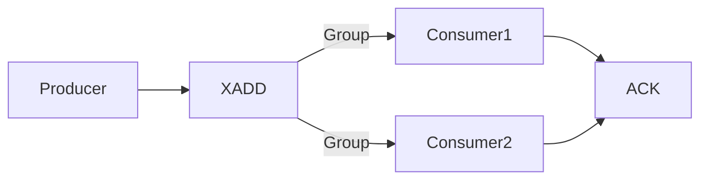

### 本文目录
<!-- toc -->

# 引言
> Redis Stream 提供持久化的消息流，适合构建轻量事件驱动架构。本文总结 Stream 的数据结构、消费组、可靠性保障与实践案例。

# 数据结构
- XADD 添加消息，带自动时间戳；
- XREAD/XREADGROUP 读取消息；
- 消费组（Consumer Group）支持水平扩展；
- Pending Entries List (PEL) 记录未确认消息。

# 架构示意

# 可靠性策略
- 使用 PEL 确保消息不丢；
- 定期执行 `XPENDING`、`XCLAIM` 重新分配；
- 设置 `MAXLEN` 控制队列长度；
- 配合 RDB/AOF 保证持久化。

# 应用场景
- 轻量任务队列、实时指标；
- 与 Spring Data Redis、Spring Cloud Stream 集成；
- 缓存更新广播、日志聚合。

# 最佳实践
- 消费者批量确认提高吞吐；
- 使用 `AUTOCLAIM` Redis 6.2+ 自动重分配消息；
- 监控 `XINFO STREAM`、`XINFO GROUPS`；
- 定期清理过期数据。

# 总结
Redis Stream 结合消费组提供可靠的事件流能力。通过 PEL 管理与定期监控，可满足事件驱动微服务需求。

# 参考资料
- [1] Redis Streams Introduction. https://redis.io/docs/data-types/streams/
