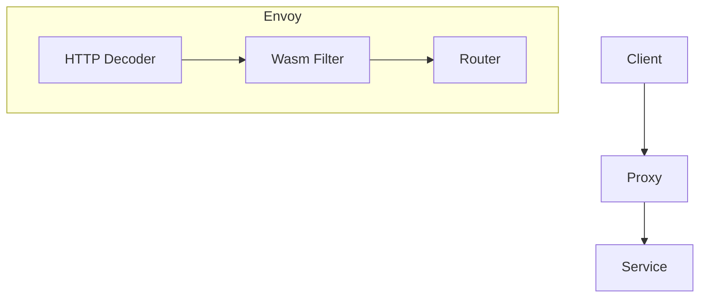

### 本文目录
<!-- toc -->

# 引言
> Envoy 通过 Filter 提供可扩展的 L4/L7 能力。在 Service Mesh 中，自定义 Filter 可以实现审计、鉴权、策略注入。本文以 Wasm 扩展为例，展示 Filter 架构。

# Filter 分类
- Listener Filter：处理连接；
- Network Filter：L4 操作；
- HTTP Filter：L7 处理；
- Wasm Filter：使用 WebAssembly 编写扩展。

# Wasm Filter 架构


# 实现步骤
1. 使用 C++/Rust/AssemblyScript 编写 Wasm；
2. 编译为 `.wasm` 模块；
3. 在 Istio `EnvoyFilter` 中指定：
```yaml
apiVersion: networking.istio.io/v1alpha3
kind: EnvoyFilter
spec:
  configPatches:
    - applyTo: HTTP_FILTER
      match:
        context: SIDECAR_INBOUND
        listener:
          filterChain:
            filter:
              name: envoy.http_connection_manager
      patch:
        operation: INSERT_BEFORE
        value:
          name: envoy.filters.http.wasm
          typed_config:
            '@type': type.googleapis.com/envoy.extensions.filters.http.wasm.v3.Wasm
            config:
              name: audit-filter
              vm_config:
                runtime: envoy.wasm.runtime.v8
                code:
                  local:
                    filename: /etc/envoy/wasm/audit.wasm
```

# 实战案例
- 请求审计：记录请求头、响应状态，写入日志；
- 安全校验：在入口执行 JWT 验证；
- A/B 实验：在 Filter 中读取实验标识，路由至不同后端；
- 速率限制：在 Filter 内调用外部 Rate Limit 服务。

# 监控与调试
- 使用 Envoy Admin `/stats`, `/config_dump`；
- 对 Wasm Filter 添加 Prometheus 指标；
- 使用 `istioctl proxy-config` 查看配置；
- 升级时滚动更新，避免中断。

# 总结
自定义 Envoy Filter 提供了灵活扩展点。通过 Wasm，我们可以以安全、可维护的方式添加业务逻辑，增强 Mesh 功能。

# 参考资料
- [1] Envoy Filter Documentation. https://www.envoyproxy.io/docs
- [2] Istio EnvoyFilter 参考. https://istio.io/latest/docs/reference/config/networking/envoy-filter/
- [3] Proxy-Wasm SDK. https://github.com/proxy-wasm/spec
