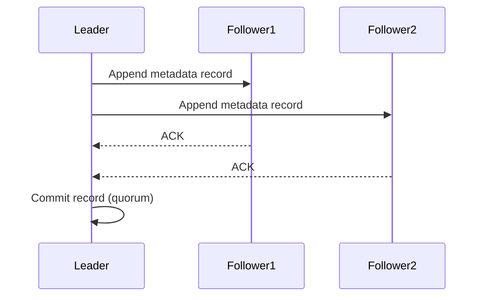

### 本文目录
<!-- toc -->

# 引言
> KRaft（Kafka Raft Metadata Mode）在 Kafka 3.x 中取代 ZooKeeper，提供更简单、可靠的元数据管理。本文解析 KRaft 架构、选举流程、迁移策略与观测手段。

# KRaft 架构概览
- **Controller 集群**：一组 Broker 角色，运行 Raft 协议；
- **Metadata Log**：topic、ACL、节点信息存储在 `@metadata` 日志；
- **Bootstrap Metadata**：`metadata.quorum.listeners` 配置；
- **节点角色**：Controller + Broker，或纯 Broker。

# Raft 协议流转

# 一致性保障
- 日志复制确保 majority 成功即提交；
- 快照机制减少日志体积；
- `controller.quorum.election.backoff.ms` 控制选举退避；
- `controller.quorum.fetch.timeout.ms` 影响复制延迟。

# 迁移策略
- 从 Zookeeper 模式迁移到 KRaft：
  1. 升级到 KRaft 兼容版本；
  2. 使用 `kafka-storage` 工具格式化元数据目录；
  3. 逐步将 Broker 切换至 KRaft；
- 也可新集群部署 KRaft，逐步迁移业务。

# 观测与故障处理
- 指标：`kafka.controller:type=KafkaController,name=ActiveBrokerCount`；
- 日志关注 `controller-quorum`；
- 故障节点通过 Raft 自动选举；
- 建议奇数个 controller 节点（3/5）。

# 总结
KRaft 简化了 Kafka 部署与运维，通过 Raft 保证元数据的一致性。迁移时需规划存储目录、指标监控和故障演练。

# 参考资料
- [1] KIP-500: Replace ZooKeeper with a Self-Managed Metadata Quorum.
- [2] Kafka Documentation: KRaft Mode. https://kafka.apache.org/documentation/#kraft
