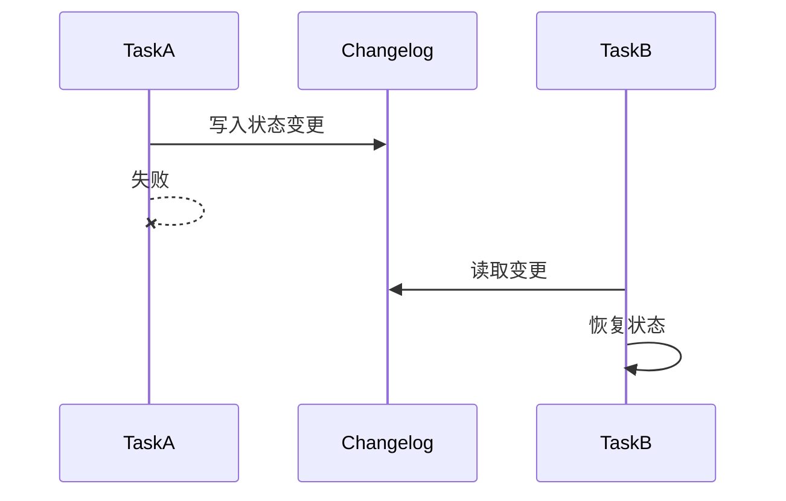

### 本文目录
<!-- toc -->

# 引言
> Kafka Streams 支持状态化计算，依赖 RocksDB 状态存储与 changelog 主题实现容错。本文梳理状态存储结构、故障恢复与优化策略。

# 状态存储
- 默认 RocksDB，每个 Task 一个 RocksDB 实例；
- 状态目录：`state.dir`；
- `changelog` 主题保存变更，实现备份；
- 可自定义 `StateStore`，例如 In-Memory。

# 容错流程

# 热备副本
- `num.standby.replicas` 配置副本任务；
- Standby Task 同步 changelog，快速切换；
- 提高成本但减少恢复时间。

# 调优建议
- 调整 RocksDB 内存：`cache.max.bytes.buffering`；
- 设置 `commit.interval.ms` 控制 flush 频率；
- 监控 `task-created`, `task-closed`；
- 使用 SSD 提升 RocksDB 性能。

# 总结
Kafka Streams 通过 RocksDB + Changelog 提供可靠的状态管理。合理配置 standby、副本与资源，可在故障时快速恢复。

# 参考资料
- [1] Kafka Streams Documentation. https://kafka.apache.org/documentation/streams/
- [2] Confluent Blog: RocksDB tuning for Kafka Streams.
