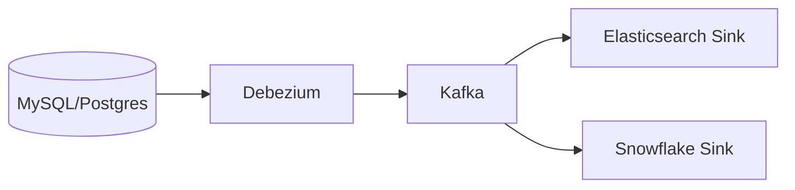

### 本文目录
<!-- toc -->

# 引言
> Kafka Connect 配合 CDC（Change Data Capture）可构建实时数据链路。本文介绍 Debezium、JDBC Source、Sink Connector 的使用与治理。

# CDC 原理
- 捕获数据库变更日志（binlog、WAL）；
- 转换为 Kafka 事件；
- 下游消费更新数据仓库、缓存、搜索等。

# 连接器架构

# 配置要点
- `connector.class=io.debezium.connector.mysql.MySqlConnector`；
- 配置 `database.history.kafka.bootstrap.servers`, `database.history.kafka.topic`；
- 拆分 Topic：`serverName.schema.table`；
- Sink Connector 配置 upsert、批处理。

# 治理策略
- Schema Registry 管理 Avro/JSON Schema；
- 对敏感数据脱敏；
- 监控 Connector 状态、延迟；
- 版本升级策略，防止 Connector 重启失控。

# 总结
Kafka Connect + CDC 提供实时数据通道。通过规范配置、Schema 管理与监控，可保证数据链路稳定可靠。

# 参考资料
- [1] Debezium Documentation. https://debezium.io/documentation
- [2] Kafka Connect User Guide. https://kafka.apache.org/documentation/#connect
