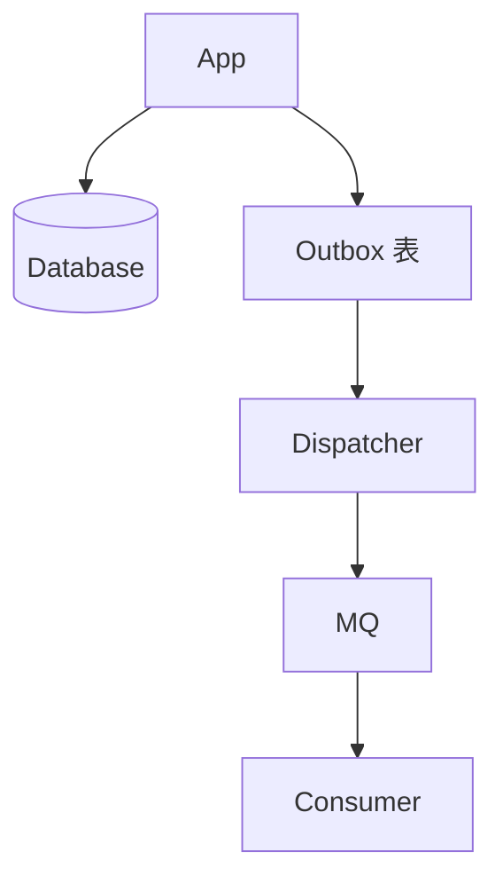

### 本文目录
<!-- toc -->

# 引言
> Outbox 模式通过数据库 Outbox 表实现本地事务与消息发送一致。本文整理 Outbox 架构、实现步骤与失败补偿策略。

# 流程
1. 业务事务写入主表与 Outbox 表；
2. Outbox 表记录消息数据、状态；
3. 后台任务读取 Outbox 表发送消息；
4. 成功后标记状态或删除。

# 架构图

# 实现要点
- Outbox 表字段：`id`, `aggregate_id`, `event_type`, `payload`, `status`, `created_at`；
- 使用 CDC（Debezium）或定时任务读取；
- 确保读取任务幂等（基于主键或状态）。

# 补偿策略
- 根据状态重试发送；
- 失败写入告警系统；
- Outbox 表定期清理或归档；
- 与 Saga/补偿事务结合。

# 总结
Outbox 模式是实现最终一致性的可靠方式。通过严格的状态管理、幂等消费和监控，可以保持业务与消息的一致。

# 参考资料
- [1] microservices.io: Transactional Outbox.
- [2] Debezium Outbox Event Router.
