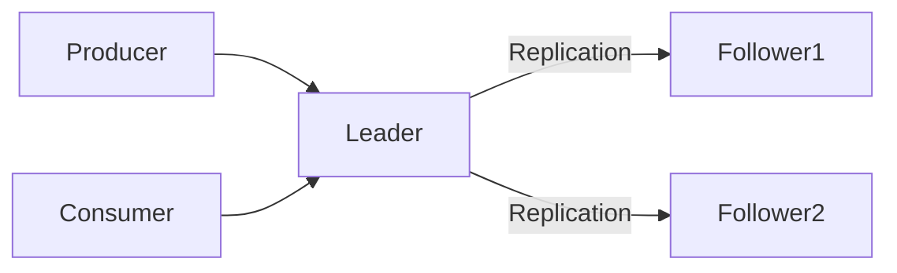

### 本文目录
<!-- toc -->

# 引言
> RocketMQ 5 引入多副本存储、DLedger、存算分离等能力。本文分析存储体系、主备同步机制、故障切换与调优要点。

# 存储架构
- CommitLog：顺序写；
- ConsumeQueue：消费索引；
- IndexFile：消息索引；
- 多副本模式下使用 DLedger（Raft）复制；
- 支持异构存储（冷热分层）。

# DLedger 工作原理
- Raft 副本：Leader + Followers；
- 日志复制保证 majority 提交；
- 自动故障切换；
- 支持透传写入磁盘/SSD。

# 架构图

# 配置要点
- 开启多副本：`enableDLegerCommitLog=true`；
- 设定节点角色：`dLegerPeers=n0#ip1:port1;n1#ip2:port2;n2#ip3:port3`；
- 设置 `storePathRootDir`、`dLegerStorePath`；
- 调整 `sendMessageThreadPoolNums`、`pullMessageThreadPoolNums`。

# 故障切换
- Leader 崩溃时，Follower 自动竞选；
- 生产者需配置 `sendLatencyFaultEnable=true`；
- 关注 `BrokerRole` 变化；
- 消费者需设置合理重试策略。

# 存储优化
- 使用 mmap + PageCache 提升吞吐；
- 控制 `transientStorePoolEnable` 与异步刷盘；
- 监控磁盘利用率、PageCache 命中率；
- 对大消息开启分片存储。

# 总结
RocketMQ 5 的多副本和存储架构提升了可靠性与扩展性。通过合理配置 DLedger、监控复制延迟，可确保消息系统稳定运行。

# 参考资料
- [1] RocketMQ 5.0 新特性介绍. https://rocketmq.apache.org
- [2] DLedger 文档. https://github.com/openmessaging/dledger
