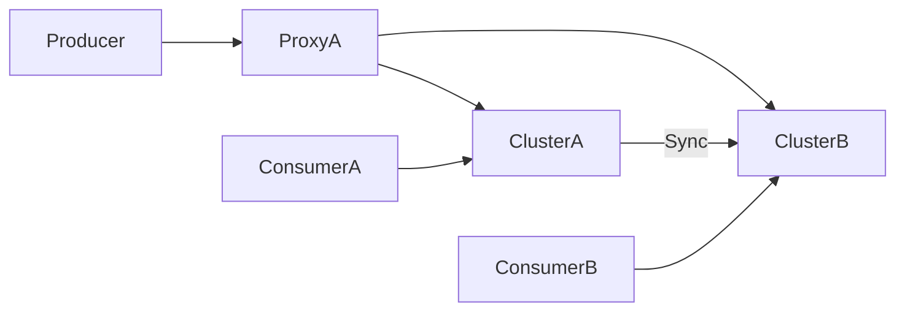

### 本文目录
<!-- toc -->

# 引言
> 异地多活可以提升系统可用性，但消息系统需要考虑跨机房复制、延迟与一致性。本文介绍 RocketMQ 多活部署模式及案例。

# 部署模式
- **同步双写**：写入两个集群，保证一致性；
- **异步复制**：主写本地，异步同步远端；
- **分区多活**：不同租户/业务定位不同机房；
- **Proxy 模式**：通过 Proxy 路由。

# 架构图

# 技术要点
- 利用 DLedger 多副本或同步复制；
- 统一命名空间/Topic 策略；
- 延迟补偿：监控 `SYNC_FLUSH`；
- 解决消息顺序：同一业务固定写入一个分区。

# 运维
- 多集群监控：延迟、堆积、复制状态；
- 拓扑切换：配置 DNS 或 Proxy；
- 演练容灾，验证回放与补偿；
- 配置中心同步，保持一致。

# 总结
RocketMQ 异地多活需在复制策略、路由和监控上投入精力。通过双写或异地复制并结合容灾演练，可实现高可用消息平台。

# 参考资料
- [1] RocketMQ 多活实践白皮书.
