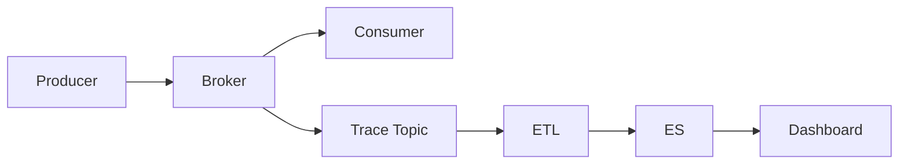

### 本文目录
<!-- toc -->

# 引言
> RocketMQ 提供消息轨迹（Trace）功能，用于跟踪消息从发送到消费的全过程。本文介绍轨迹实现、审计模型以及与监控平台的集成。

# 消息轨迹机制
- Enable Trace：`traceTopic`、`enableMsgTrace=true`；
- Producer、Consumer 插件记录轨迹数据；
- 轨迹消息写入 `RMQ_SYS_TRACE_TOPIC`；
- 包含发送时间、消费时间、耗时、状态。

# 审计流程
1. 采集轨迹数据写入存储（HBase、ElasticSearch）；
2. 建立查询接口，根据 msgId/bizId 检索；
3. 与报警系统结合，发现异常消费；
4. 对关键消息设置 SLA。

# 架构示意

# 实践建议
- 独立部署 Trace ETL，避免影响业务链路；
- 对轨迹数据设置保留策略；
- 构建可视化界面展示耗时、失败率；
- 与链路追踪（Zipkin）整合，提高定位效率。

# 总结
消息轨迹为审计与排障提供关键数据。通过完善的采集、存储与可视化体系，可快速定位消息链路问题。

# 参考资料
- [1] RocketMQ 消息轨迹文档.
- [2] 阿里云消息队列 Trace 实践.
