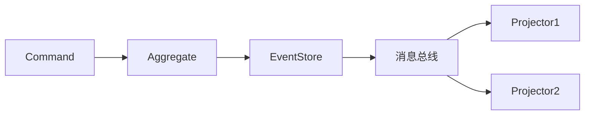

### 本文目录
<!-- toc -->

# 引言
> 事件溯源（Event Sourcing）要求所有状态变更以事件形式记录，消息总线是核心传输通道。本文介绍在事件溯源架构中设计消息总线的策略。

# 架构要点
- Event Store（Kafka、EventStoreDB）记录不可变事件；
- Command/Query 分离（CQRS）；
- 消费者重放事件构建视图；
- 消息总线保障顺序、幂等与回放能力。

# 设计原则
- Topic 按聚合根划分，确保顺序；
- 事件 schema 版本化；
- 采用 Outbox 或 CDC 将事件写入总线；
- 提供事件回放接口。

# 流程示意

# 关键挑战
- 大量历史事件回放的性能；
- 事件演进中的兼容性；
- 事件幂等消费与快照；
- 数据隐私与脱敏。

# 实践建议
- 对关键聚合使用快照减少重放时间；
- 保持事件不可变，新增字段兼容旧消费者；
- 对事件总线设置访问控制；
- 引入监控平台统计事件滞后与消费进度。

# 总结
在事件溯源中，消息总线承担事件传播与回放职责。通过合理的 Topic 设计、兼容策略与监控，可以构建可追溯的事件驱动系统。

# 参考资料
- [1] Martin Fowler: Event Sourcing.
- [2] Greg Young: CQRS Documents.
