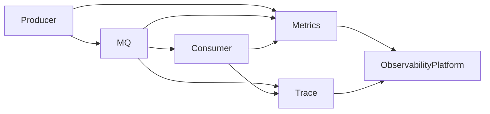

### 本文目录
<!-- toc -->

# 引言
> 消息链路跨越生产者、Broker、消费者，需要统一的观测平台。本文介绍指标、日志、追踪的整合方案。

# 指标体系
- 生产者：发送速率、失败率、重试；
- Broker：吞吐、堆积、延迟、磁盘；
- 消费者：Lag、耗时、错误率；
- 可视化 Dashboard（Grafana）。

# 追踪
- 使用 OpenTelemetry、Zipkin；
- 传递 TraceId：消息头携带；
- RocketMQ Trace、Kafka 自研 Trace；
- 追踪数据与日志关联。

# 日志
- 标准化日志格式，包含 msgId、topic、partition；
- 采集至 ELK/Loki；
- 建立检索模板，快速定位。

# 集成架构

# 实践建议
- 建立告警规则（Lag、失败率、延迟）；
- 统一指标命名规范；
- 对跨云部署整合多平台数据；
- 定期复盘观测指标。

# 总结
统一观察平台让消息链路透明可控。通过整合指标、日志与追踪，可快速定位问题并持续优化性能。

# 参考资料
- [1] OpenTelemetry Messaging Semantic Conventions.
- [2] Confluent Control Center 指标参考.
