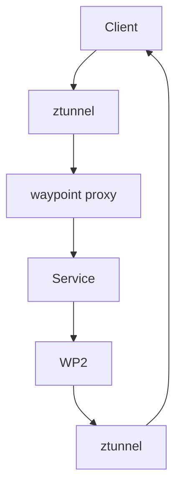

### 本文目录
<!-- toc -->

# 引言
> Istio Ambient Mesh 以 Sidecar-less 模式降低资源成本。本文对 Ambient Mesh 的 L4/L7 分层、数据面组件与适用场景进行解析。

# 架构特征
- 将流量拦截从 Sidecar 转移至 `ztunnel`（L4 代理）与 `waypoint`（L7 代理）；
- 减少 Sidecar 带来的 CPU/内存开销；
- 逐步迁移，无需改动应用。

# 架构图

# 优势
- Sidecar-less，降低运维复杂度；
- L4/L7 解耦，按需部署 Waypoint；
- 多集群支持更优；
- 支持 mTLS、RBAC、Telemetry。

# 挑战
- Ambient Mesh 仍处于开发阶段，功能不全面；
- 对于需要复杂 L7 功能的服务仍需 Waypoint；
- 迁移时需评估兼容性。

# 实战建议
- 先在测试环境体验，评估资源收益；
- 对无状态服务尝试 Ambient，逐步推广；
- 结合 HPA/Autoscale 优化资源；
- 监控 `ztunnel` 指标：连接数、延迟。

# 总结
Ambient Mesh 为 Istio 带来新的部署模型。未来在降低成本与简化运维方面具有潜力，但当前仍需谨慎评估成熟度。

# 参考资料
- [1] Istio Ambient Mesh介绍. https://istio.io/latest/blog/2022/ambient-announce/
- [2] Istio Ambient Mesh 架构文档.
