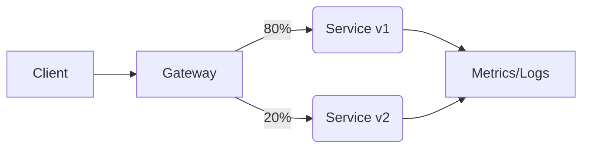

### 本文目录
<!-- toc -->

# 引言
> 金丝雀发布通过分阶段放量降低上线风险。Service Mesh 提供细粒度流量控制、指标采集、回滚能力。本文以 Istio 为例，解析金丝雀架构并展示流量路由图。

# 基本流程
1. 部署 v1、v2 两个版本；
2. 使用 VirtualService 控制流量权重；
3. 监控指标、日志、Trace；
4. 若异常，立即回滚。

# 流程图


# 配置示例
```yaml
apiVersion: networking.istio.io/v1alpha3
kind: VirtualService
spec:
  hosts:
    - api.example.com
  http:
    - route:
        - destination:
            host: service
            subset: v1
          weight: 80
        - destination:
            host: service
            subset: v2
          weight: 20
```

# 观测指标
- 请求成功率、延迟（P95/P99）；
- 错误日志、异常率；
- Trace 分布；
- 下游依赖负载。

# 自动化策略
- 使用 Prometheus + Alertmanager 设置阈值；
- 结合 Argo Rollouts 实现自动放量；
- 若指标恶化，自动回滚；
- 配合 CI/CD Pipeline，确保发布流程一致。

# 总结
Service Mesh 让金丝雀发布更易实施。通过流量权重、观测与回滚策略，可以大幅降低上线风险。

# 参考资料
- [1] Istio VirtualService 文档. https://istio.io/latest/docs/reference/config/networking/virtual-service/
- [2] Argo Rollouts. https://argo-rollouts.readthedocs.io
