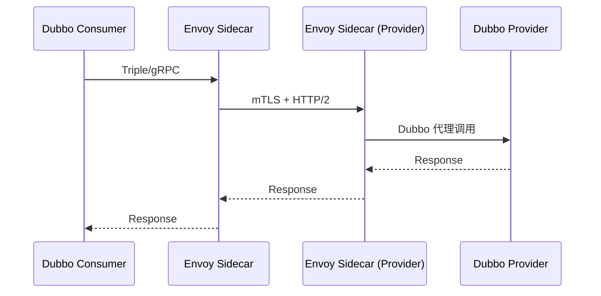

### 本文目录
<!-- toc -->

# 引言
> Dubbo 在微服务中广泛使用，而 Istio 提供了标准化服务网格能力。Dubbo Mesh 旨在让 Dubbo 应用平滑迁移到 Mesh 环境。本文探讨 Dubbo Mesh 架构与 Istio Sidecar 协同模式，并绘制数据面流程图。

# 架构概览
- **控制面**：Istio Pilot 管理路由策略，Dubbo Mesh Controller 与 Pilot 同步；
- **数据面**：Envoy Sidecar 代理 Dubbo Triple/gRPC 流量；
- **应用**：Dubbo SDK 仍负责业务逻辑。

# 数据面流程

# 关键配置
- Istio `ServiceEntry` 定义 Dubbo 服务；
- `VirtualService` 控制路由版本、灰度；
- Dubbo Mesh 提供 `mesh.yaml`，声明服务、路由、治理策略；
- mTLS 必须启用，确保服务间安全。

# 倡导实践
- 编写 Sidecar 注入策略，保持 Dubbo 应用无侵入；
- 在 Pilot 中配置 `Protocol=Dubbo`，启用 L7 能力；
- 监控：Dubbo Metrics + Istio Telemetry；
- 使用 Zipkin/Jaeger 聚合应用与 Mesh Trace。

# 挑战与解决
- **双重治理**：避免 Dubbo 与 Istio 策略冲突，统一在 Mesh 层；
- **延迟**：Sidecar 增加延迟，需要调优 Envoy；
- **兼容性**：老 Dubbo2 协议需代理转换；
- **可观测性**：将 Dubbo 指标导出到 Prometheus，与 Envoy 指标整合。

# 总结
Dubbo Mesh 让 Dubbo 应用与 Istio 无缝协同。通过合理配置路由、安全与可观测性，可以实现服务治理与 Mesh 的融合。

# 参考资料
- [1] Dubbo Mesh 项目文档. https://github.com/apache/dubbo-go-pixiu
- [2] Istio 官方文档. https://istio.io/latest/docs/
- [3] Envoy Proxy Documentation. https://www.envoyproxy.io/docs/
