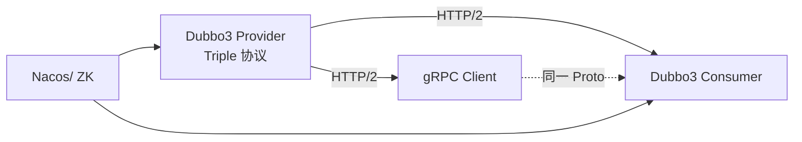

### 本文目录
<!-- toc -->

# 引言
> Dubbo3 引入的 Triple 协议基于 HTTP/2 与 Protobuf，旨在与 gRPC 互通。本文分析 Triple 的设计、互通细节与生产部署经验，并使用 Mermaid 绘制互通架构。

# Triple 协议概述
- 使用 HTTP/2 双向流，与 gRPC 框架兼容；
- Protobuf 作为 IDL，可复用 proto 文件；
- 支持服务端推送、双向流式调用；
- 与旧 Dubbo 协议（Dubbo2）共存，支持渐进迁移。

# gRPC 互通要点
1. **IDL 统一**：共享 `.proto` 文件；
2. **Service 定义**：Dubbo3 使用 `@DubboService` 与 `@DubboReference`；
3. **协议配置**：
```yaml
dubbo:
  protocol:
    name: tri
    port: 50051
  registry:
    address: nacos://127.0.0.1:8848
```
4. **gRPC 客户端**：使用 `io.grpc.ManagedChannelBuilder` 指向 Dubbo 服务；
5. **压缩与元数据**：Triple 支持 gRPC Metadata。

# 架构示意


# 性能考量
- Triple 避免了 Dubbo2 的自定义二进制协议，降低了跨语言成本；
- HTTP/2 多路复用提升吞吐，但需关注 Header 压缩开销；
- 使用 Netty 作为底层 transport，优化 TLS/ALPN 配置；
- gRPC 客户端需设置 `keepalive` 防止连接断开。

# 生产经验
- 在多语言部署中（Go、Java），Triple + gRPC 互通成功；
- 需统一超时、重试策略，避免 Dubbo 与 gRPC 行为差异；
- 使用 Dubbo Admin 与 gRPC Health Check 监控服务状态；
- 对慢调用启用 Zipkin/OTel Trace 收集。

# 总结
Dubbo3 Triple 协议提供了与 gRPC 的自然互通路径。通过统一 IDL、协议配置与监控体系，可以平滑实现跨语言 RPC。

# 参考资料
- [1] Apache Dubbo Triple 文档. https://dubbo.apache.org/zh/docs3-v2/java-sdk/advanced-features-and-usage/serialization/triple/
- [2] gRPC 官方文档. https://grpc.io/docs/
- [3] Dubbo 3.0 用户指南.
