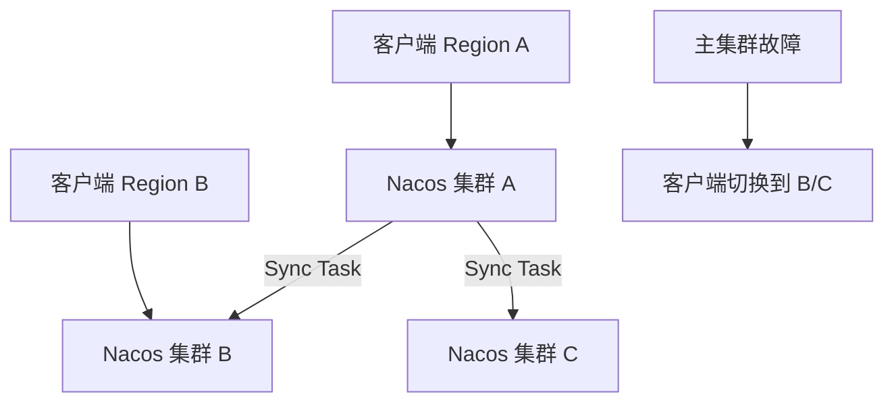

### 本文目录
<!-- toc -->

# 引言
> Nacos 同时提供服务注册与配置能力。多集群部署可实现跨机房容灾与就近访问。本文介绍多集群架构、同步策略与故障切换流程。

# 多集群架构
- **Region**：按地域划分集群，每个 Region 内部三副本；
- **Cluster**：逻辑集群，同步数据；
- **CMDB**：记录实例 metadata；
- **Sync Task**：跨集群数据同步。

# 流程图

# 注册容灾
- 客户端在本地 Region 注册实例；
- 使用 `spring.cloud.alibaba.nacos.discovery.cluster-name` 指定集群；
- Failover 时，客户端通过 `NamingService` 获取其他集群地址；
- 对跨Region请求设置权重，优先本地。

# 配置容灾
- 配置同步：`nacos-sync` 工具或自研；
- 灰度变更：按集群逐步推送；
- 客户端缓存：`nacos.localCacheDir`；
- 断网时读取本地快照，恢复后同步。

# 监控与告警
- 指标：`nacos_service_count`, `config_push_qps`；
- 通过 Prometheus Exporter 收集；
- 事件通知：Webhook、DingTalk/Slack；
- SLA：注册延迟 < 5s，配置推送 < 2s。

# 总结
Nacos 多集群需要配合集群同步、客户端策略与监控体系。通过合理部署和容灾演练，可确保注册与配置高可用。

# 参考资料
- [1] Nacos 官方文档. https://nacos.io/zh/docs/current/
- [2] Spring Cloud Alibaba Nacos. https://spring-cloud-alibaba-group.github.io/
- [3] Alibaba Cloud Nacos 多集群最佳实践.
