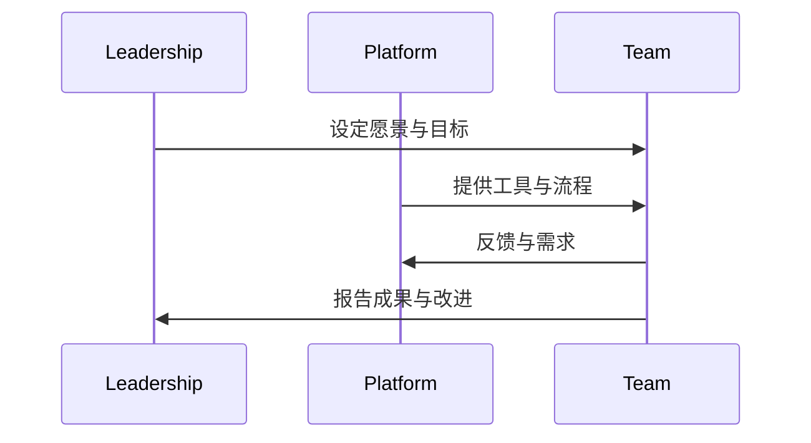

### 本文目录
<!-- toc -->

# 引言
> DevOps 落地不仅是工具问题，更涉及组织结构、文化与流程。本文总结常见阻力与应对策略。

# 常见阻力
- 职责分散、团队壁垒；
- 工具链碎片化；
- 缺乏可衡量目标；
- 安全与合规担忧；
- 文化惯性与抗拒变革。

# 解法
- 组建跨职能团队（Squad）；
- 建立统一平台（平台工程）；
- 定义工程指标（DORA、MTTR、NPS）；
- 引入自动化测试与 CI/CD；
- 安全左移，建立 DevSecOps；
- 变革沟通、培训、激励机制。

# 进阶策略

# 总结
DevOps 落地需要组织、技术与文化同步推进。通过平台工程、指标驱动和安全融合，可逐渐消除阻力，实现持续交付目标。

# 参考资料
- [1] Accelerate: Building and Scaling High Performing Technology Organizations.
- [2] Team Topologies.
