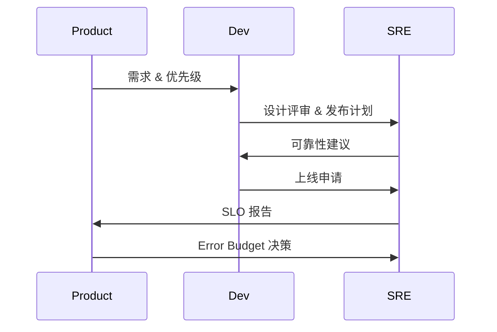

### 本文目录
<!-- toc -->

# 引言
> SRE（Site Reliability Engineering）强调可靠性，而产品团队关注体验与创新。明确双方责任边界，才能兼顾稳定与敏捷。本文梳理职责划分、协作流程与 SLO 管理。

# 责任划分
- 产品团队：需求定义、功能设计、业务优先级；
- 开发团队：功能实现、单元测试、性能优化；
- SRE 团队：可靠性目标、监控告警、容量规划、灾备；
- 共同承担：上线评审、故障响应、复盘。

# 协作机制
- SLO/SLI/SLA 体系，产品/SRE 共同制定；
- 错误预算（Error Budget）作为决策依据；
- 变更管理：上线审批、发布闸门；
- Incident Management：值班轮值、故障演练。

# 流程图

# 实践建议
- 建立联合评审（Design/Launch Review）；
- 共享监控与错误预算看板；
- 故障复盘引入产品团队；
- 业务节奏与运维窗口对齐。

# 总结
明确责任边界并建立协作机制，让 SRE 与产品团队形成互补。在可靠性数据驱动下，能平衡创新速度与稳定性。

# 参考资料
- [1] Google SRE Book.
- [2] Error Budget Policy Templates.
