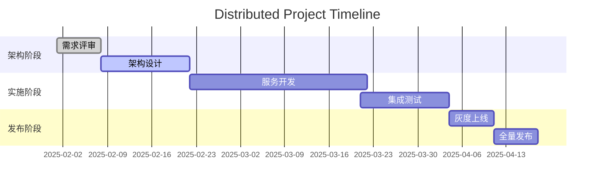

### 本文目录
<!-- toc -->

# 引言
> 分布式项目跨多团队、多模块协作，节奏控制直接影响交付质量。本文总结节奏规划、里程碑管理、风险缓冲与可视化跟踪方法。

# 节奏规划
- 明确里程碑：需求冻结、架构评审、集成、灰度上线；
- 设置节奏周期（如双周 Sprint + 月度集成）；
- 统筹资源，建立核心路径（Critical Path）。

# 里程碑与缓冲
- 在关键节点设置缓冲（缓冲区/关键链）；
- 使用 RAG（Red/Amber/Green）标识健康度；
- 定期评审，调整计划；
- 引入业务方、SRE 参与，共同评估风险。

# 可视化与跟踪

# 沟通机制
- 每周项目例会 + 日常 Standup；
- 跨团队同步（产品、架构、QA、运维）；
- 建立风险与问题日志；
- 使用协作平台（Jira、Notion、飞书 OKR）。

# 审核与复盘
- 节奏控制指标：计划达成率、上线窗口、异常数；
- 关键节点引入评审与审批；
- 项目结束后复盘，积累最佳实践。

# 总结
大规模项目需要明确的节奏规划、里程碑管理与跨团队协作机制。通过可视化跟踪、缓冲设计与持续沟通，可提高交付成功率。

# 参考资料
- [1] PMI PMBOK 第七版.
- [2] Google SRE Workbook: Managing Incidents.
