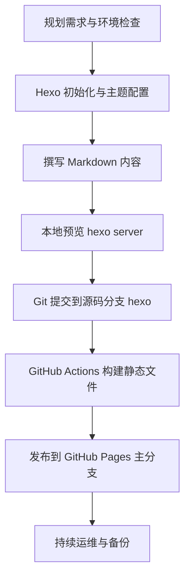

### 本文目录
<!-- toc -->

# 中文版

## 1. 背景与目标
- 目标：在 1 小时内完成 Hexo 博客的本地搭建、GitHub Pages 托管与自动化发布，形成可持续迭代的个人知识库。
- 适用人群：初学者、想要快速上线个人站点的工程师、产品或技术写作者。
- 输出成果：一套包含源码分支与静态页面分支的 GitHub 仓库、本地可编辑的 Hexo 工作目录、自动化部署流水线与备份方案。

> Hexo 官方文档说明它以 Node.js 为基础，将 Markdown 转换成静态网页，适合开发者定制化扩展 [[Hexo Docs](https://hexo.io/docs/)]。GitHub Pages 提供静态托管服务，可直接发布 Hexo 构建产物 [[GitHub Pages Docs](https://docs.github.com/pages/getting-started-with-github-pages)].

### 站点上线流程速览



## 2. 环境准备清单
| 工具 | 推荐版本 | 验证命令 | 备注 |
| --- | --- | --- | --- |
| Node.js | ≥ 18 LTS | `node -v` | Hexo 4.x 官方建议使用 LTS 版本，保证包管理器与插件兼容。 |
| npm | ≥ 9 | `npm -v` | 与 Node.js LTS 配套发布。 |
| Git | ≥ 2.34 | `git --version` | 支持 GitHub OAuth 与安全协议。 |
| GitHub 账号 | 最新 | 浏览器登录 | 需要启用双因素验证与 SSH key。 |

```bash
# macOS 使用 Homebrew 安装/升级示例
brew install node git
node -v
npm -v
```

> 参考：Node.js 官方下载页 [[Node.js Downloads](https://nodejs.org/en/download/)]；Git 安装指南 [[Git Docs](https://git-scm.com/book/en/v2/Getting-Started-Installing-Git)].

## 3. 初始化 Hexo 项目
### 3.1 创建目录与安装 CLI
```bash
npm install -g hexo-cli
hexo init imchenway.com
cd imchenway.com
npm install
```
- `hexo init` 会生成基础目录结构，包括 `_config.yml`、`source/_posts`、`themes` 等。
- 默认主题为 landscape，可在后续替换为 anatole 或其他主题。

### 3.2 项目结构速览
```text
imchenway.com
├── _config.yml          # 站点级配置
├── package.json         # 依赖与脚本
├── scaffolds/           # 新文章模板
├── source/
│   ├── _posts/          # Markdown 文章
│   └── images/          # 建议自建，存放插图
└── themes/              # 主题目录
```
建议立即创建统一的图片目录：
```bash
mkdir -p source/images/posts/github-hexo-setup
```

## 4. GitHub Pages 仓库与分支策略
### 4.1 创建仓库
1. 新建仓库 `imchenway.github.io`（Public）。
2. 勾选 README 与 `.gitignore` 可选项以便初始提交。

### 4.2 Git 远程配置
```bash
git init
curl -o .gitignore https://raw.githubusercontent.com/github/gitignore/main/Node.gitignore
cat >> .gitignore <<'END'
public/
.deploy_git/
END

git remote add origin git@github.com:imchenway/imchenway.github.io.git
```
> GitHub 建议使用 SSH key 认证，可参考官方指南 [[GitHub SSH Docs](https://docs.github.com/authentication/connecting-to-github-with-ssh)].

### 4.3 分支设计
- `hexo`：存放 Hexo 源码与内容（默认工作分支）。
- `master` 或 `gh-pages`：存放静态站点，供 GitHub Pages 发布。
- 备份分支（可选）：用于 `hexo-git-backup` 插件备份主题与配置。

## 5. 内容创作与本地预览流程
```bash
hexo new "第一篇文章"
hexo server # 访问 http://localhost:4000
```
- 建议在 `scaffolds/post.md` 中增加 `categories`、`summary` 等字段，确保文章结构统一。
- 写作时使用 Markdown + Mermaid，配合 `hexo-filter-mermaid-diagrams` 插件生成流程图或序列图。

### 内容校验清单
- `npm run build`：确保 Markdown 无语法错误、引用路径正确。
- `npm run server`：手动检查页面布局、TOC 与代码高亮。

## 6. 自动化部署（GitHub Actions）
在仓库根目录创建 `.github/workflows/deploy.yml`：
```yaml
name: Hexo Deploy
on:
  push:
    branches: [hexo]
jobs:
  build:
    runs-on: ubuntu-latest
    steps:
      - uses: actions/checkout@v4
        with:
          fetch-depth: 0
      - uses: actions/setup-node@v4
        with:
          node-version: '20'
      - run: npm install
      - run: npx hexo generate
      - name: Deploy
        uses: peaceiris/actions-gh-pages@v3
        with:
          github_token: ${{ secrets.GITHUB_TOKEN }}
          publish_dir: ./public
          publish_branch: master
```
> 官方行动指引：GitHub Actions + GitHub Pages [[GitHub Pages Action Guide](https://docs.github.com/actions/deployment/deploying-to-your-cloud-provider/deploying-to-github-pages)].

## 7. 安全与运维
- **SSH Key 管理**：定期轮换密钥，撤销旧设备；启用 GitHub 2FA。
- **密钥保护**：不要在 `_config.yml` 中硬编码敏感信息，若使用自定义域名证书请存储在仓库 Secret。
- **监控与备份**：`hexo backup` 定期推送到备份分支；利用 GitHub Insights 观察访问趋势。
- **性能优化**：可结合 Cloudflare 为 GitHub Pages 提供 CDN，加快全球访问。

## 8. 实战案例：30 分钟上线知识博客
1. 10 分钟：完成 Node、Git 环境校验与 Hexo 初始化。
2. 5 分钟：撰写首篇文章并添加封面图与 Mermaid 图。
3. 5 分钟：配置 GitHub 仓库、生成 SSH key。
4. 10 分钟：推送到 `hexo` 分支，触发 Actions 自动发布。
结果：`https://imchenway.github.io/` 成功上线，并在 Actions 日志中确认构建成功。

## 9. 常见问题排查
| 症状 | 可能原因 | 处理建议 |
| --- | --- | --- |
| `npm install` 失败 | 网络阻塞或权限不足 | 切换镜像源，例如 `npm config set registry https://registry.npmmirror.com`。 |
| GitHub Pages 返回 404 | 发布分支未选中或 CNAME 缺失 | 仓库 Settings → Pages 指定正确分支，并确认 `source/CNAME` 存在。 |
| Actions 构建超时 | 缓存残留或插件冲突 | 在工作流中增加 `hexo clean`，升级插件版本。 |
| 图片不显示 | 路径大小写不一致 | 使用 `/images/posts/...` 绝对路径，保持全小写。 |

## 10. 进一步扩展
- 接入 Algolia 搜索与 `hexo-generator-sitemap`，提升 SEO。
- 编写 Node.js 脚本批量生成文章模板、校验 front-matter。
- 结合 GitHub Issues/Discussions 建立读者反馈与内容策划流程。

## 11. 参考资料
- Hexo 官方文档：https://hexo.io/docs/
- GitHub Pages 官方指南：https://docs.github.com/pages/
- Node.js LTS 发布计划：https://github.com/nodejs/release#release-schedule
- Git 工具书：《Pro Git》第 2 版：https://git-scm.com/book/en/v2
- GitHub Actions Marketplace：https://github.com/marketplace?type=actions
- Unsplash 图片授权：https://unsplash.com/license

# English Version

## 1. Background & Objectives
- Goal: bootstrap a Hexo blog, host it on GitHub Pages, and automate deployment within an hour.
- Audience: developers, product managers, and technical writers who prefer Markdown-driven workflows.
- Deliverables: a Git repository with separate source/static branches, a local Hexo workspace, CI/CD automation, and backup strategy.

> Hexo converts Markdown content into static assets via Node.js [[Hexo Docs](https://hexo.io/docs/)]. GitHub Pages offers free static hosting tightly integrated with Git [[GitHub Pages Docs](https://docs.github.com/pages/)].

### Deployment Pipeline Overview


## 2. Prerequisites
| Tool | Recommended | Verification | Notes |
| --- | --- | --- | --- |
| Node.js | 18 LTS or newer | `node -v` | Matches Hexo 4.x requirements. |
| npm | ≥ 9 | `npm -v` | Ships with Node.js releases. |
| Git | ≥ 2.34 | `git --version` | Supports strong crypto defaults and SSH U2F. |
| GitHub Account | Enabled | Browser login | Turn on 2FA and register SSH key. |

## 3. Initialize Hexo Workspace
```bash
npm install -g hexo-cli
hexo init imchenway.com
cd imchenway.com
npm install
mkdir -p source/images/posts/github-hexo-setup
```
- Review `_config.yml` for site-wide settings and `themes/` for theme assets.
- Pin dependency versions in `package.json` to keep builds reproducible.

## 4. GitHub Pages Setup
1. Create repository `imchenway.github.io`.
2. Clone locally and keep the `hexo` branch as your working branch.
3. Extend `.gitignore` to exclude `public/` and `.deploy_git/` folders.
4. Generate an SSH key (`ssh-keygen -t ed25519 -C "email"`) and add it to GitHub [[SSH Docs](https://docs.github.com/authentication/connecting-to-github-with-ssh)].

## 5. Writing & Previewing
- Use `hexo new post "Title"` to scaffold posts with consistent front-matter.
- Run `hexo server` for live preview at `http://localhost:4000`.
- Store media assets under `source/images/posts/<slug>/` and embed them with absolute paths.

## 6. Continuous Deployment
Create `.github/workflows/deploy.yml` using `actions/setup-node` and `peaceiris/actions-gh-pages`. Trigger on pushes to `hexo`, publish the `public/` directory to `master` (or `gh-pages`). Double-check repository Settings → Pages for the correct branch selection.

## 7. Security & Operations
- Rotate SSH keys periodically and revoke lost devices.
- Store custom domain certificates or tokens in GitHub Secrets.
- Enable branch protection and required status checks on the `hexo` branch.
- Schedule `hexo clean && npm run build` in CI to detect broken links and invalid assets early.

## 8. Case Study: 30-Minute Rollout
- 10 min: validate environment and initialize Hexo.
- 5 min: write the first bilingual post with hero image.
- 5 min: configure repository, push to `hexo`.
- 10 min: monitor GitHub Actions, verify `https://imchenway.github.io/` is reachable.

## 9. Troubleshooting
| Symptom | Root Cause | Remedy |
| --- | --- | --- |
| `hexo generate` stuck | Outdated cache or incompatible plugins | Run `hexo clean`, upgrade packages, inspect plugin changelog. |
| Pages build warning | Missing CNAME or theme assets | Re-run workflow, ensure `source/CNAME` exists, review theme docs. |
| Images missing | Case-sensitive paths on Linux runners | Use lowercase directories and absolute URLs. |
| Workflow quota exceeded | Repeated dependency downloads | Enable `actions/cache` for `~/.npm` and prune unused plugins. |

## 10. Further Enhancements
- Integrate Algolia DocSearch or Pagefind for instant search.
- Add Lighthouse audits via GitHub Actions for performance regression alerts.
- Implement content staging with preview deployments or custom branches.

## 11. References
- Hexo Official Docs: https://hexo.io/docs/
- GitHub Pages Getting Started: https://docs.github.com/pages/
- peaceiris/actions-gh-pages README: https://github.com/peaceiris/actions-gh-pages
- Node.js Release Schedule: https://github.com/nodejs/release
- GitHub Actions Workflow syntax: https://docs.github.com/actions/using-workflows/workflow-syntax-for-github-actions
- Unsplash License: https://unsplash.com/license
